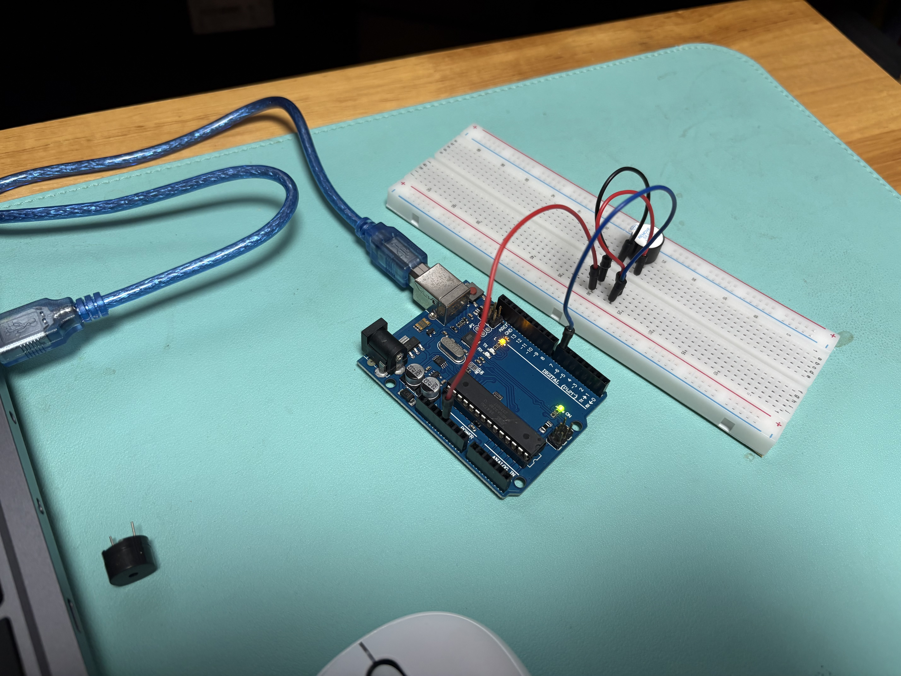

이 패키지에는 능동 버저와 수동 버저가 있다.
능동 버저는 안에 이미 회로가 들어 있어 전압만 걸어주면 되는 버저이고,
수동 버저는 회로가 없어 직접 소리 출력과 관련된 코드를 작성해 주어야 하는 버저이다.

LED 를 사용했을 때 PWM 을 이용하여 밝기를 조절했을 때와 마찬가지로, 음계도 같은 식으로 조절한다.
그러나 한 가지 차이점이 있다.

밝기 : Frequency 를 고정한 채 Duty 를 변경. 
        - 한 주기 내에 LED 가 켜져 있는 시간의 비율을 늘려가며 밝기를 키운다.

소리 : Duty 를 고정한 채 Frequency 를 변경.
        - 소리가 나는 시간의 비율은 정해져 있지만, 주기의 반복 속도를 높여 음계를 높인다.

소스코드 이름이 "Piezo" 로 되어 있어서, 이게 뭔가 했더니
이것이 바로 버저 내에서 소리를 내주는 주요 부품이라고 한다.

이 금속판에 전압을 걸면 판이 한 쪽으로 휘었다가, 전압이 풀리면 원상태로 돌아오는 중에 공기를 때리며 소리를 내는 방식.
사람의 성대와 유사하다.