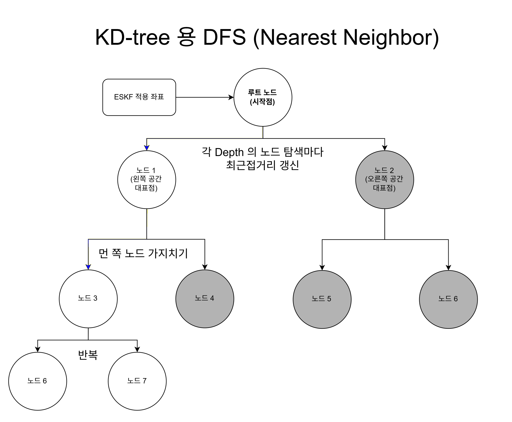
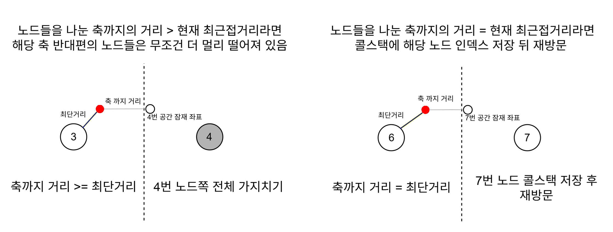
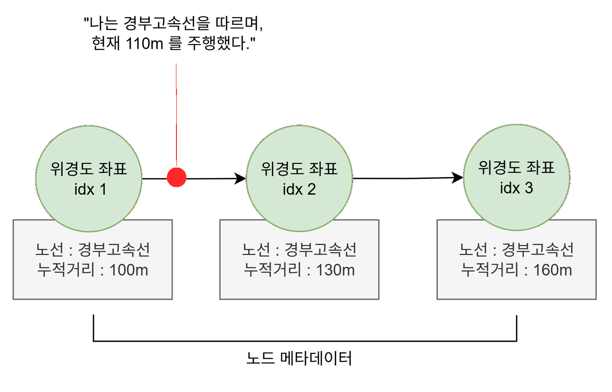

일반적인 KD TREE 는 하나의 지도를 수 많은 평면 조각들로 나눈 다음에, 기준점과 해당 평면에서 가장 가까운 점을 순차적으로 탐색한다.
그리고 더 가까워질 여지가 있다면 다른 평면을 추가로 탐색하곤 한다.

이것은 어떤 물체가 사실상 자유롭게 이동한다면 아주 효율적인 알고리즘이 될 수 있다. 좌표의 갯수와 관계없이 탐색 시간에 O(nlogn) 의 시간이 소요되기 때문이다.

그러나 열차는 자유롭게 이동하지 않는다. 각각의 열차는 스케쥴에 따라 가야 할 노선이 정해져 있을 뿐만 아니라, 해당 노선 위에서도 철로 위의 좌표밖에 따라가지 못한다. 그러므로 각 좌표 데이터에 노선 및 누적거리에 대한 메타데이터를 등록해준다면, 단순한 배열 데이터로 치환 가능하다.

해당 열차가 어떤 노선을 달리고 있는지 알고 있다면, 그 노선에 해당하는 좌표 데이터 범위만 접근한다. 그리고 자신이 지금까지 얼마나 달렸는지 알고 있다면, 누적거리를 통하여 배열의 몇 번째 노드를 달리고 있는지도 알아낼 수 있다.

열차의 진행에 따라 접근 속도도 향상된다. 왜냐하면 KD TREE 처럼 매번 원점 노드부터 탐색을 하는 것이 아니라, 열차가 이미 지나온 인덱스부터 탐색하면 되기 때문이다. (열차가 역행을 하지 않는다는 가정 하에)

실제로 위의 방식을 서울~오송 구간을 운행하는 KTX 에서 시험해 보았더니, 좌표 데이터 접근 및 연산 시간이 200% 감소하였다.
다만 GPS 가 터지지 않는 환경에서 열차가 자신이 달린 거리를 연산하는 방식의 정밀도를 높일 필요가 있을 것 같다.
그리고 열차가 셔틀 운행을 할 때를 대비하여, 열차의 방향에 따라 배열 접근 방식을 달리해야 할 필요도 있다.

